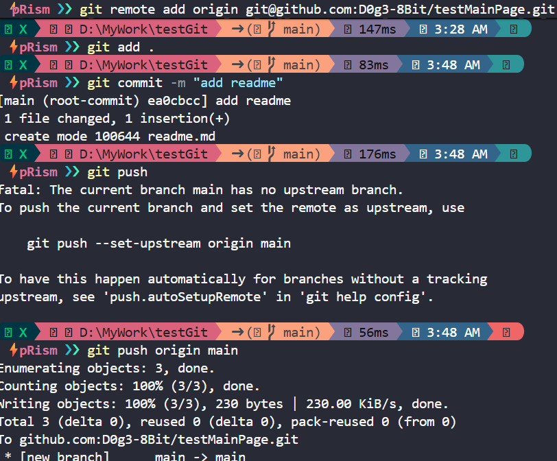
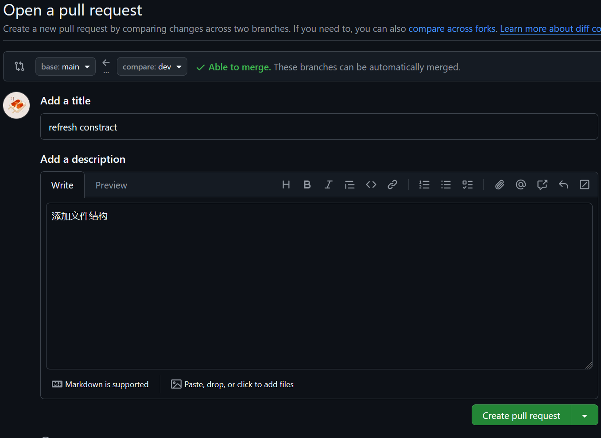
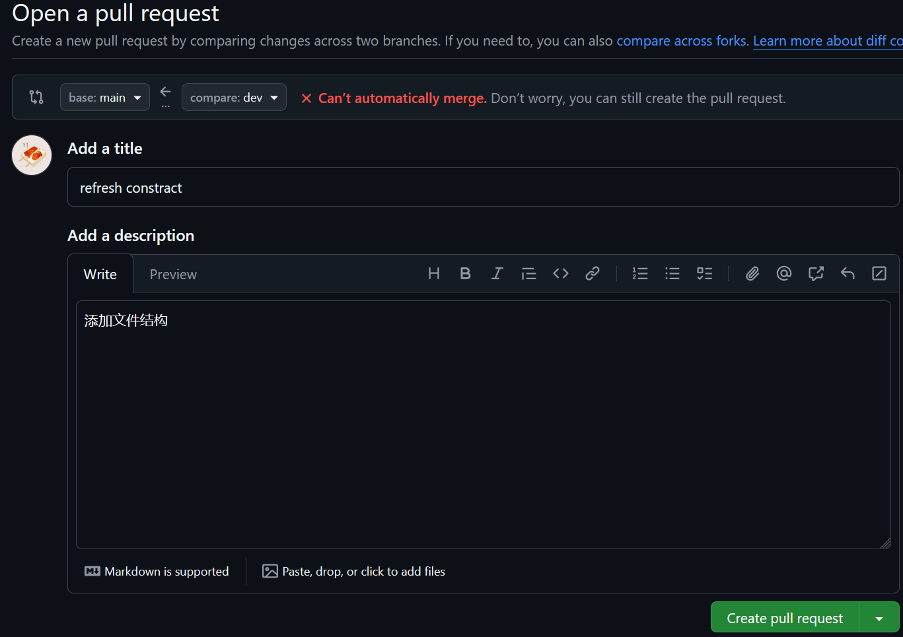
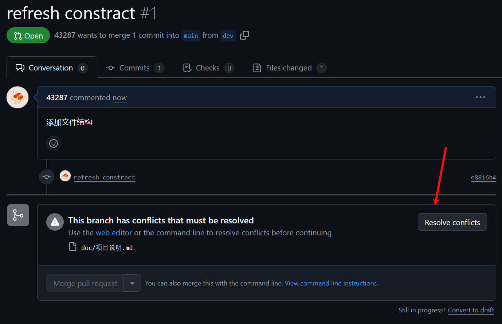
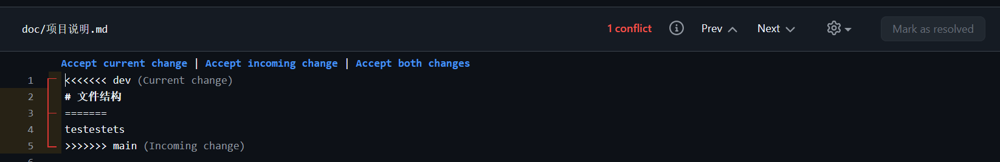
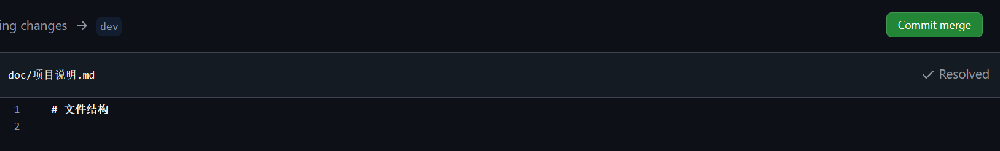

# git

git是当前最常用的版本管理工具，每个开发者本地都有完整仓库历史，便于离线提交与分支管理。本篇介绍git和版本管理常见的操作，简要介绍了如何连接本地和远程仓库，如何从仓库拉取内容，如何提交内容，多人协作时如何解决冲突，如何移动到分支，如何合并分支，如何回退等内容。


# 初始化与远程仓库连接

本地创建仓库时，只需要使用`git init`即可创建本地仓库，此时会生成`.git`文件夹。此时还未同步远程仓库，使用

```git
git remote add origin <url>
```

将远程仓库和本地关联。

另一种初始化方式是`git clone <url>`，也就是说直接克隆远程仓库，克隆后，对应的本地仓库内容会和远程仓库相同。


# 提交更改与推送

> 基本概念
> 
> 工作区：存放本地文件的区域
> 
> 暂存区：本地文件进行增删改后，可以将变更提交到暂存区，上传内容时，只会上传提交到暂存区的内容
> 
> 本地仓库：.git文件夹中的内容，记录所有提交历史
> 
> 远程仓库：托管在服务器上的仓库


git的运行基于文件在上述区域的流转：初始状态下，增删改后的文件为未跟踪，当提交到暂存区后被标记为已暂存，提交内容时，文件修改被保存到本地仓库，成为`历史版本`。

而以上操作均可通过命令实现：

```git
git add <file path>
git commit

git add .
git commit -m "xxxxx"
```

`git add`命令用来添加某个未跟踪的文件到暂存区，如果使用`git add .`则会快速添加当前目录下所有未跟踪文件到暂存区。`git commit`则用来提交暂存区文件到本地仓库。实现这两个操作后，便可通过其他命令来实现详细的版本管理。

```git
git push origin <remotebranch>
git push
```

本地更新好后，便可直接使用`git push`来上传文件到远程仓库，首次使用需要指定远程分支名否则不会推送成功(origin是远程仓库默认别名)，具体操作类似如下：



# 分支与开发

> 分支是一条独立的开发线，不同分支的版本内容互不影响

一般情况下，为了防止多人协作产生的bug问题，开发不会都main或master分支中，一般该分支会被当作主分支用来最后合并代码。因此我们需要创建新分支并在新分支中实现我们的代码。

使用

```git
git switch <branch-name>
git switch -c <branch-name>
```

来切换当前分支，其中，带`-c`的版本是以当前状态创建新分支并切换到对应分支

> 顺带一提，如果在切换分支前，有内容是未提交的，同时现在不想提交，就需要使用`git stash`相关命令来暂时保存
> 
> ```git
> git stash push
> 保存当前状态
> 
> git stash pop
> 恢复当前状态并删除保存
> 
> 
> git stash apply
> 恢复状态但不删除
> 
> 
> ```

切换后，可以直接写代码，同时将内容提交到对应分支。


# 冲突与合并

当提交内容到新分支后，远程仓库会显示：


## pull request

pull request是一种合并分支的方法，需要在远程仓库人工评审代码后才可将分支合并，



此处没有冲突，因此可以直接合并。

现在我们直接在远程仓库创建相同文件，展示冲突情况，此时会变成这样：



点击Create pull request后，会出现手动选择文件的界面





手动解决即可



## merge/rebase/pull

出现冲突的原因在于：合并时两个分支都分别进行了修改。因此，如果可以先同步一个最新的分支，然后再合并，就可以解决这个问题。

```git
git merge <branch-name>
```

将指定的分支合并到当前分支，举例：当前分支a，使用`git merge b`，会将最新的b的内容同步到a，此时若有冲突依旧需要解决。这种方式会创建一个合并提交(merge commit)。

一般情况下，开发环境代码先merge main，测试通过后再switch到main来merge 开发环境。防止未知的bug先同步到main。


如果不想要出现合并提交而是保持线性，可以用rebase

```git
git rebase <branch-name>
```

该命令将当前分支的提交移动至目标分支之后。

举例：当前分支：a->b，目标分支：c->d->e，使用后：目标分支c->d->e->a->b


pull也是类似的命令，但是要先提`git fetch`，这个命令会将远程仓库的内容下载下来，而不提交

使用`git pull`就是自动执行`fetch`然后自动`merge`。

同时也有`git pull --rebase`的fetch+rebase变体版本。


以上几个指令依旧需要解决冲突。只不过是在本地解决，而不像pull request在远程解决。


