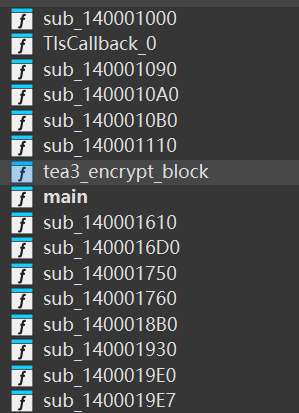
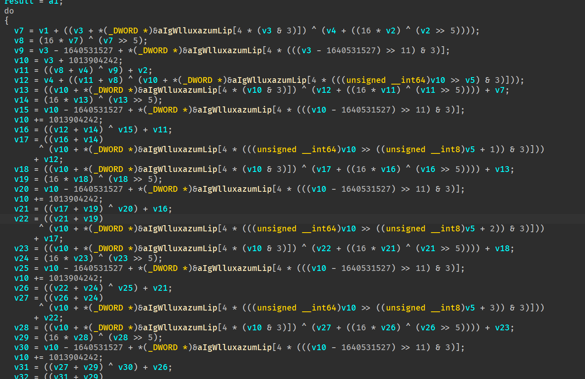

# 简介

笔者在本篇尝试通过氛围编程指示AI完成逆向。体验后，发现AI在小型程序分析代码上体验较为良好，在编写逆向EXP上仅能做到常见加密方式的解密还原，如若魔改，可分析出魔改点，但是不能完成EXP的编写，该类题型属于常见的普通CTF比赛的签到题目。在针对无混淆的VM上，其可以很大成都上减轻人力，自行分析handler，该类题目属于常见大型比赛的必出题目。总结：在无混淆环境，AI的理解能力很强，超过人类。

本篇不涉及环境的配置。


# 环境

使用Trae solo coder + [cybermaxluo](https://github.com/cybermaxluo) [IDAProMCP_Max](https://github.com/cybermaxluo/IDAProMCP_Max) + ida9.2

使用的测试题目内容是：

```markdown
TLS修改key，主要加密为魔改TEA加密
主要加密代码：

void xtea_encrypt(uint32_t v[3], const uint32_t k[4]) {
    uint32_t v0 = v[0], v1 = v[1],v2 = v[2], sum = 0;
    for (uint32_t i = 0; i < ROUNDS; i++) {
        v0 += (((v1 << 4) ^ (v1 >> 5)) + v2) ^ (sum + k[sum & 3]);
        sum += DELTA;
        v1 += (((v0 << 4) ^ (v0 >> 5)) + v2) ^ (sum + k[(sum >> 11) & 3]);
        sum += DELTA;
        v2 += (((v0 << 4) ^ (v0 >> 5)) + v1) ^ (sum + k[(sum >> i) & 3]);
    }
    v[0] = v0; v[1] = v1; v[2] = v2;
}


```

二进制环境：release打包：


函数量小，加密优化程度高

# 体验尝试

将以下内容作为规则直接让AI逆向：

```markdown
这是一个CTF 逆向工程任务，相较于个人规则优先遵循以下内容：

1.尝试使用IDA mcp来进行逆向分析
2.将分析流程和写exp代码流程分开，先生成分析报告到doc文件夹，报告通过后，先尝试对ida重要函数及变量进行重命名，然后使用报告内容辅以IDA mcp来生成exp代码
3.可以使用任意语言来实现exp的编写，需要考虑语言和原始代码语言是否方便转换。编写时，根据分析报告分段内容执行，每生成一段内容就进行测试，尝试使得每一部分均能正确执行。
4.任务结束后，生成一份writeup，包括分析过程、exp编写过程等
5.除非用户指定，否则绝不使用z3

名词解析：
关键输入：用户输入flag的位置
关键比较：所有用来判断flag是否正确的位置，往往比较失败会输出错误信息
关键加密函数：用户输入的flag会经过加密函数或者保存的密文会经过解密函数，这些变换数据的函数是关键加密函数。
可疑内容：不像是编译器生成的代码，而/是人工编写的代码，往往包含加密/哈希，反静态分析/反调试等内容。

现在提供三种基本逆向手法：

遍历型：
遍历所有用户函数，取得交叉引用和调用图，并分析每个函数的作用和每个用户函数的关联性。最后找到关键输入和比较输出位置进而专注分析关键加密函数。
信息收集型：
尝试运行程序，同时尝试模拟输出得到程序关键字符串等信息。通过查询字符串的交叉引用得到关键输入或比较点。然后向上或向下寻找关键加密函数
可疑内容型：
尝试寻找可疑内容，比如栈帧破损的函数，TLS回调函数，异常处理函数或明显的用户自行实现的汇编代码或花指令。往往这些内容内嵌在程序正常流程之中，通过分析这些流程的调用关系，找到关键输入，关键比较，关键加密函数。
```

直接可给出回答，且流程遵循规定，十分快捷：

```markdown
目标

- 逆向 normalTea.exe，定位关键输入、关键比较、关键加密函数，提取用于构造 exp 的全部参数与常量。

入口与主流程

- 入口点：`TlsCallback_0` at `0x140001040`，`start` at `0x140001c90`。
- 主函数：`main` at `0x140001550`。
- 主流程：
  - 分配 49 字节缓冲区；读取格式 `"%48s"` 的用户输入（函数 `sub_140001110` 封装 `_stdio_common_vfscanf`）。
  - 按 12 字节分块，从偏移 36→24→12→0 依次调用 `sub_140001170` 对每块进行原地变换。
  - 逐字节将缓冲区与全局表 `TARGET_48` 比较，相等则输出 `yes!`，否则输出 `try again!`。

关键比较

- 比较表地址：`byte_140003290`（已重命名为 `TARGET_48`）。
- 48 字节值：
  - `21 79 49 7f d7 56 3d 93 b0 22 4e 21 98 28 44 66 04 47 36 a3 cc 32 2a 99 fa 34 b6 46 48 2d b2 ed 83 69 cd 2b 51 c7 ca c0 f6 30 e0 e4 4f b1 f0 31`。

关键加密函数

- 地址：`sub_140001170`。
- 形态：TEA/XTEA 风格变种，针对 3×32bit（12 字节）数据块；每次调用从 `sum=0`、`v5=0` 开始，进行 8 组小轮（总 64 次常量推进）。
- 常量：
  - `C1 = 1640531527 (0x61C88647)`；在若干步中以 `sum - C1` 参与混合。
  - `C2 = 1013904242 (0x3C6EF372)`；每小轮多次 `sum += C2`，最终 `sum_end = 8*C2 = 0xE3779B90`。
- 密钥来源：
  - 全局字节表 `aIgWlluxazumLip`（IDA 自动命名），取前 16 字节按小端拼成 4 个 `u32`：`KEYS[0..3]`。
- 典型操作：
  - `fmix(x) = (x<<4) ^ (x>>5)`（与 TEA 类似的位混合）。
  - 轮函数对 3 个字 `v1/v2/v4` 交替更新，并按 `sum` 不同位移选择密钥序号 `KEYS[(sum >> shift) & 3]`。

辅助函数

- 输入包装：`sub_140001110`，调用 `_stdio_common_vfscanf`；输出包装：`sub_1400010B0`，调用 `_stdio_common_vfprintf`。
- TLS 回调：`TlsCallback_0` 调用 `sub_140001930` 做初始化，无反调试行为。

数据流概览

- 输入 `buf[48]` → 4 个 12 字节块，按顺序（36,24,12,0）调用 `sub_140001170(buf+i)` → 原地更新后与 `TARGET_48` 比较。

结论与下一步

- 已确定关键输入（48 字节）、关键比较（`TARGET_48`）、关键加密函数（3×32bit TEA 变种）以及全部常量与密钥来源。
- exp 将实现该变种的逆变换（解密），对 `TARGET_48` 做分块逆变换得到明文 flag；随后提供分段测试确保每块输出与 IDA 伪代码一致。


```

由于本题目TLS为动态生成，在TLS0中反编译代码并没有显示出如何注册TLS1，导致AI没有发现TLS1的存在。由于提示词，其基于数据流反编译代码，导致其错过key的解密函数，因为key的解密函数的交叉引用为动态计算，且上层代码(TLS1)通过花指令隐藏了key的解密代码的调用，导致其没有发现解密密钥的位置。也就是说：在本提示词的情况下，AI分析时过度依赖反编译代码。

以上部分可以通过提示词和添加知识库的方式简单解决。同时，我测试了4次同一提示词，AI有的使用暴力搜索的方法，确实得到了正确的key解密流程并完成了解密操作(毕竟就是一个异或)，不过仍需提升稳定性，需要让ai知道哪些内容是可疑的，需要详细查看的。

exp脚本编写问题：

类似TEA魔改这类题，往往笔者自己都会错很多次才写对，一般我会通过调试，一步一步确认是否有问题。而MCP现在只能静态分析，没有提供动态调试的方法，如果提供了，那么对比错误时将会很方便。


# 结论

如简介所说：当前任意一个没有经过”逆向培训“的AI都可以实现无混淆程序的分析和编写EXP的流程。在新生赛很方便。而当进入带混淆环境和release版本中时，则需要尝试提供更多提示词，知识库，最后提供动态分析的agent来实现自动化流程的流畅和完善。

同时，仍需优化提示词。寻找更好的找出隐藏逻辑的方法。
