花了一周，把Mizuki博客部署好了。


# 简介

本文记录了笔者通过github和vercel部署Mizuki博客的整个流程。本文不包含博客的基本信息配置，如：修改风格和字体或其他元素。

之所以使用Mizuki搭建博客有因为它有以下几个优势：

- 开箱即用，不需要额外配置

- 二次元

- 自带归档/标签/分类系统

- 用户可随意修改主题配置

- markdown支持mermaid

- 使用文件夹管理博客文章，图片使用相对目录，无需图床
  
  

# 准备

- 一个域名

- 有github账号及两个git仓库
  
  - 一个作为博客代码仓库，存放博客代码
  
  - 一个作为博客内容仓库，存放文章图片等内容

- vercel账号，用于部署静态页面

- 本地pnpm环境，用于本地预览和修改
  
  

 在官方仓库下载release版本博客代码并解压到任意目录下，后将该目录称为代码根目录

::github{repo="matsuzaka-yuki/Mizuki"}

:::note
官方建议使用release版本代码以防生产环境代码出现不可知的错误
:::


# 本地初始化

- 在项目代码根目录下执行`pnpm install`初始化依赖包

- 然后执行`pnpm dev`，此时代码会被部署到localhost:4321，可通过shell ctrl+单击打开网页并查看效果
  
  

如需本地部署，使用`pnpm build`生成输出代码到dist目录，本文不涉及相关内容

# 实现本地上传代码到github并关联vercel

创建新仓库(下记为Mizuki)并推送。

在仓库action中出现build信息就算成功：


通过[该网址](https://vercel.com/new)将github关联到vercel的新项目

等待vercel部署成功：

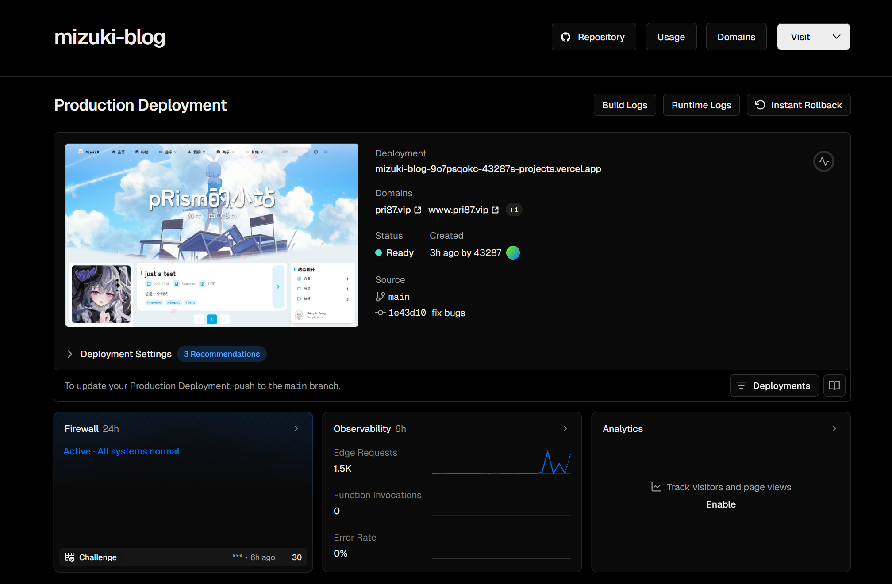

此时，当push到git仓库时，该项目会自动拉取并重部署。

尝试修改src/content/posts中的内容并推送，按理会让vercel项目自动redeploy。


不知道为什么直接进它给的域名网速很慢，所以最好自己配一个域名

## 添加域名

进入domins界面

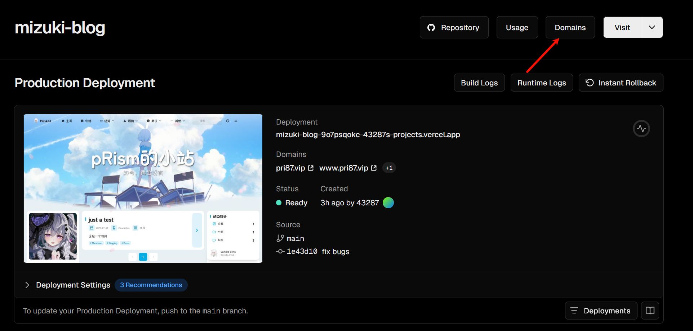

Add Domin

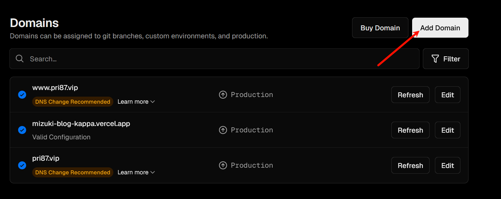

填写自己的域名并connect至production环境，点击save

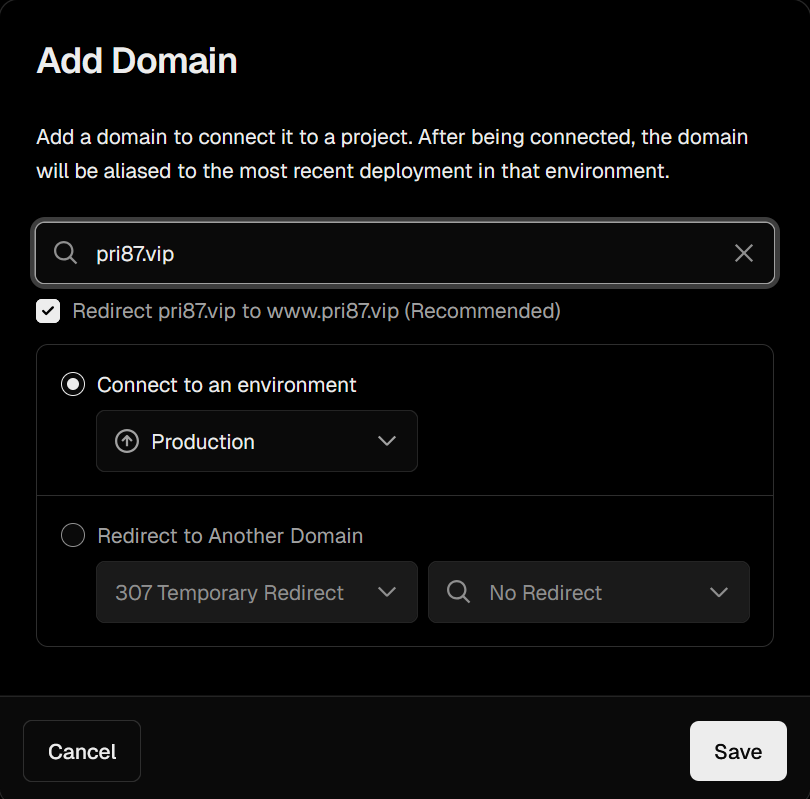

之后返回domins界面，对新创建的域名点击learn more：

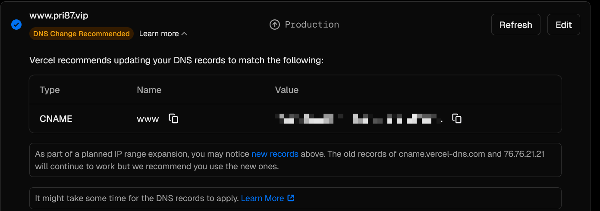

将该解析记录填入域名的域名解析中（在购买域名的服务商管理台中填写）

然后尝试用自定义域名连接，如果步骤正确，应当会成功。


目前，项目关系图：


# 实现内容和代码分离

如果不分离，写代码要在仓库的src文件夹里面写，层数比较深，备份时需要备份所有内容，不方便迁移内容或远程办公。

如果可以实现分离，每次只需要推送代码内容即可，远程办公时只需拉取内容，不用下载整个仓库，上传也是。同时支持多人合作。有效防止手贱和博客爆炸


因此创建内容仓库来实现内容分离

创建时，一般创建为私有仓库，防止加密文章效果失效，如果不在意可以用公开仓库。

私有仓库的访问只能在、github认证之后才可以拉取，如果是本地，需要用公私钥连接，此处不再赘述。如果是vercel则见后

内容仓库的结构是：

```markdown
Mizuki-Content/
├── posts/              # 博客文章 (Markdown)
│   ├── *.md            # 单文件形式文章
│   └── guide/          # 文件夹形式文章
├── spec/               # 特殊页面
│   ├── about.md        # 关于页面
│   └── friends.md      # 友链页面
├── data/               # 结构化数据
│   ├── anime.ts        # 番剧数据
│   ├── devices.ts      # 设备数据
│   ├── diary.ts        # 日记数据
│   ├── friends.ts      # 日记数据
│   ├── projects.ts     # 项目展示
│   ├── skills.ts       # 技能数据
│   └── timeline.ts     # 时间线
├── images/             # 图片资源
│   ├── posts/          # 文章配图
│   ├── albums/         # 相册图片
│   └── diary/          # 日记图片
└── .github/
    └── workflows/      # 自动构建触发器
```

可参考

::github{repo="matsuzaka-yuki/Mizuki-Contentki"}

完成操作后，将代码仓库中的内容直接拷贝过来或者重新写内容文件。

## 本地内容分离

:::note
下面的步骤可省略，只是在想看本地效果的时候执行
:::

在代码根目录.env文件

```yml
ENABLE_CONTENT_SYNC=true

# 内容仓库的 Git URL (仅在 ENABLE_CONTENT_SYNC=true 时需要)
# 支持 HTTPS 和 SSH 两种方式:
# HTTPS: https://github.com/your-username/Mizuki-Content.git
# SSH: git@github.com:your-username/Mizuki-Content.git
CONTENT_REPO_URL=git@github.com:name/contents.git

# 内容目录路径 (相对于项目根目录)
# 默认: ./content 一般无需改动
CONTENT_DIR=./content
```

设置好后，执行`pnpm build`,项目会先拉取仓库内容到根目录的./content，然后设置真实目录为映射到content目录中内容仓库对应结构的符号链接，最后进行build，实现了`本地`内容分离构建。

目前项目结构：

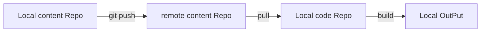


## vercel内容分离

 编辑vercel环境变量：

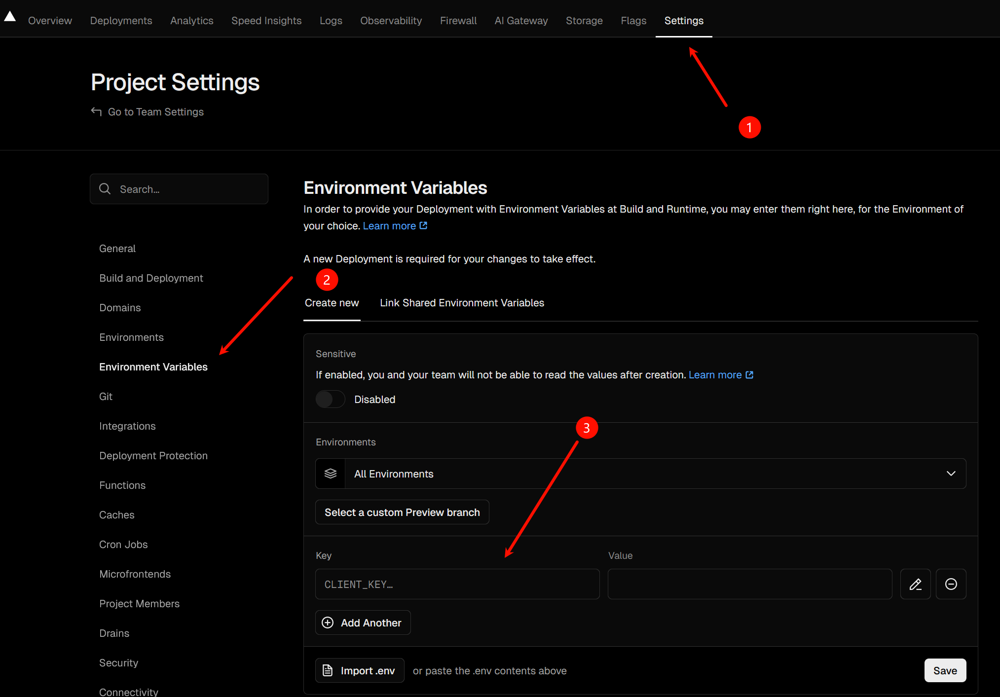

```
ENABLE_CONTENT_SYNC=true
GITHUB_TOKEN=ghp_your_personal_access_token
CONTENT_REPO_URL=https://${GITHUB_TOKEN}@github.com/your-username/Mizuki-Content-Private.git
USE_SUBMODULE=false
```

其中GITHUB_TOKEN需要在github中生成：

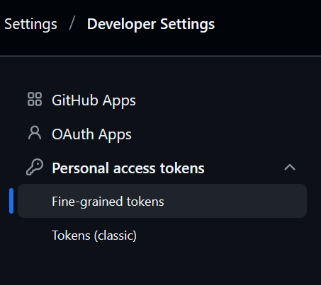

在用户设置/Developer Settings/Personal access tokens中选择Generate new token，只关联内容仓库，属性为Read-Only，生成密钥后复制到Vercel项目的环境变量中

编辑完后点击保存，这样vercel项目进行rebuild时会先拉取该仓库的内容，具体原理同`本地内容分离`一节。


由于push内容仓库后，不会自动rebuild代码仓库，所以不会触发vercel的自动重构，所以需要配置vercel的web-hook以及执行触发

### Deploy Hook设置

在vercel项目/Setting/Git/Deploy Hooks中，生成一个Deploy Hook

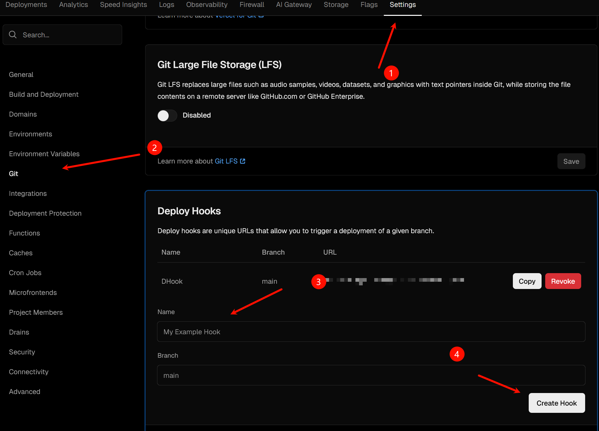

将其复制，然后在下一节`触发器设置`中填写

### 触发器设置

在内容仓库.github/workflows中添加文件[trigger-vercel.yml](https://github.com/matsuzaka-yuki/Mizuki-Content/blob/master/.github/workflows/trigger-vercel.yml.example "trigger-vercel.yml.example")或者在下方复制：

```yml
# Vercel Deploy Hook 触发器
# 
# 当内容仓库更新时,通过 Vercel Deploy Hook 触发重新部署
# 
# 配置步骤:
# 1. 在 Vercel 项目设置中获取 Deploy Hook URL
#    Settings → Git → Deploy Hooks → Create Hook
# 2. 在本仓库添加 Secret:
#    Settings → Secrets → New repository secret
#    Name: VERCEL_DEPLOY_HOOK
#    Value: 粘贴 Deploy Hook URL
# 3. 推送代码测试

name: Trigger Vercel Deployment

on:
  push:
    branches:
      - master
    paths:
      # 只在内容文件变化时触发
      - 'posts/**'
      - 'spec/**'
      - 'data/**'
      - 'images/**'
  workflow_dispatch:

jobs:
  trigger:
    runs-on: ubuntu-latest
    steps:
      - name: Trigger Vercel Deploy Hook
        run: |
          response=$(curl -s -w "\n%{http_code}" -X POST "${{ secrets.VERCEL_DEPLOY_HOOK }}")
          http_code=$(echo "$response" | tail -n1)

          if [ "$http_code" -eq 200 ] || [ "$http_code" -eq 201 ]; then
            echo "✅ Vercel deployment triggered successfully"
          else
            echo "❌ Failed to trigger deployment. HTTP code: $http_code"
            exit 1
          fi

      - name: Job summary
        if: success()
        run: |
          echo "✅ Vercel deployment triggered successfully" >> $GITHUB_STEP_SUMMARY
          echo "" >> $GITHUB_STEP_SUMMARY
          echo "**Commit Details:**" >> $GITHUB_STEP_SUMMARY
          echo "- SHA: \`${{ github.sha }}\`" >> $GITHUB_STEP_SUMMARY
          echo "- Message: ${{ github.event.head_commit.message }}" >> $GITHUB_STEP_SUMMARY
          echo "- Author: ${{ github.event.head_commit.author.name }}" >> $GITHUB_STEP_SUMMARY
```

在github项目设置中新建Secret

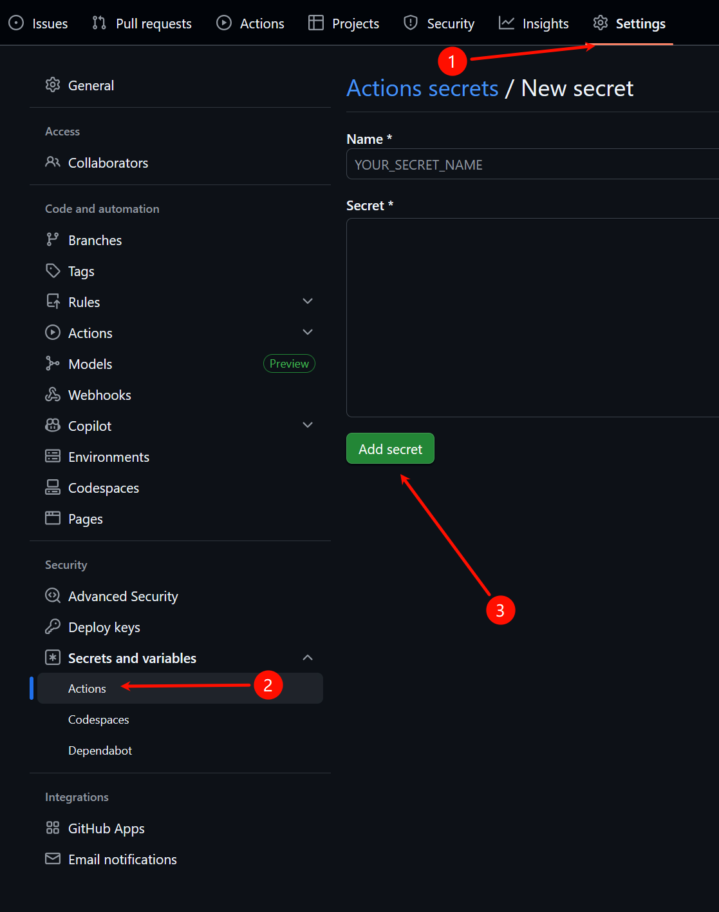

```
Settings → Secrets → New repository secret
Name: VERCEL_DEPLOY_HOOK
Value: 粘贴 Deploy Hook URL
```


设置后，实现无论代码仓库更新还是内容仓库更新，都会触发vercel仓库rebuild，同时代码和内容互不影响


最终项目结构：

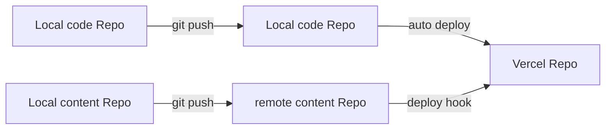


